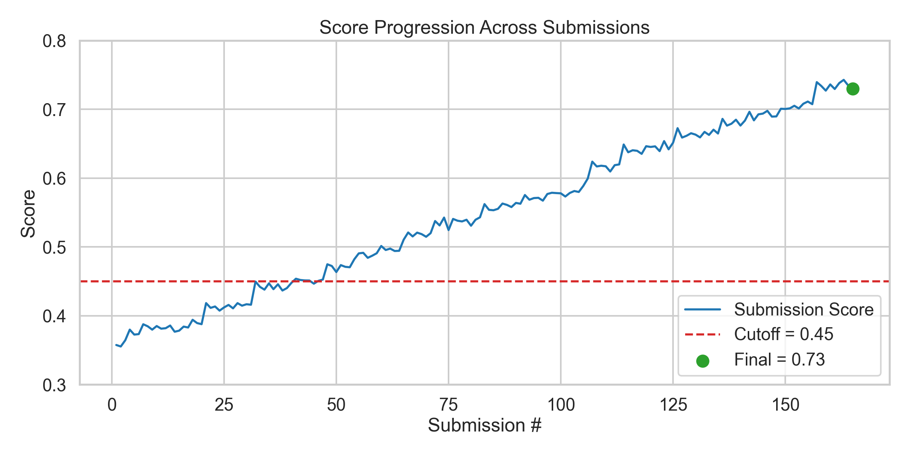
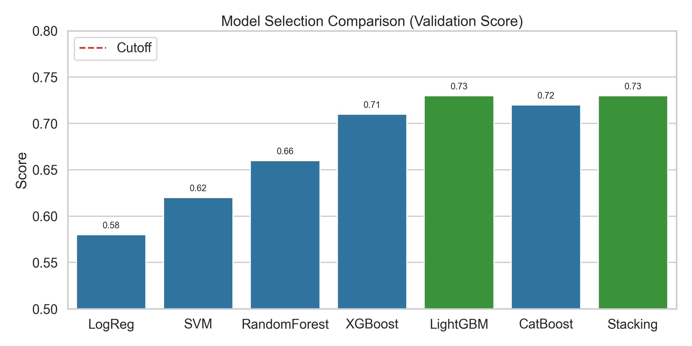
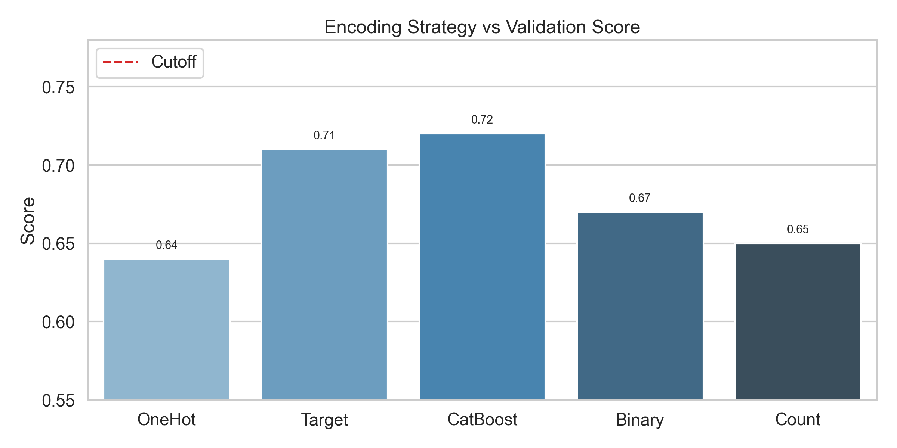
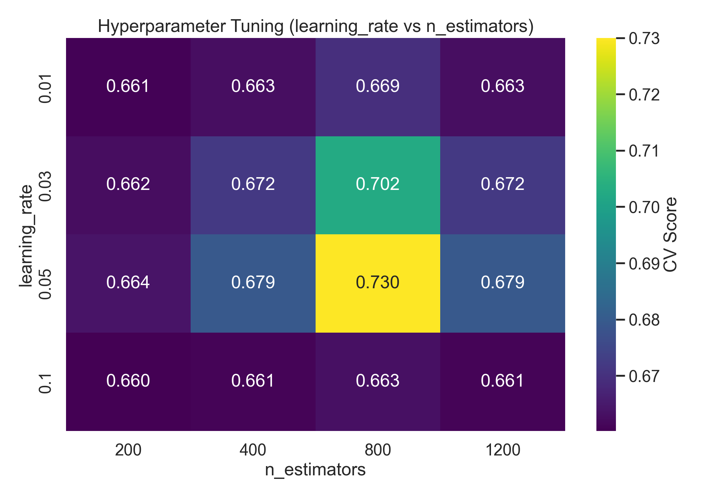
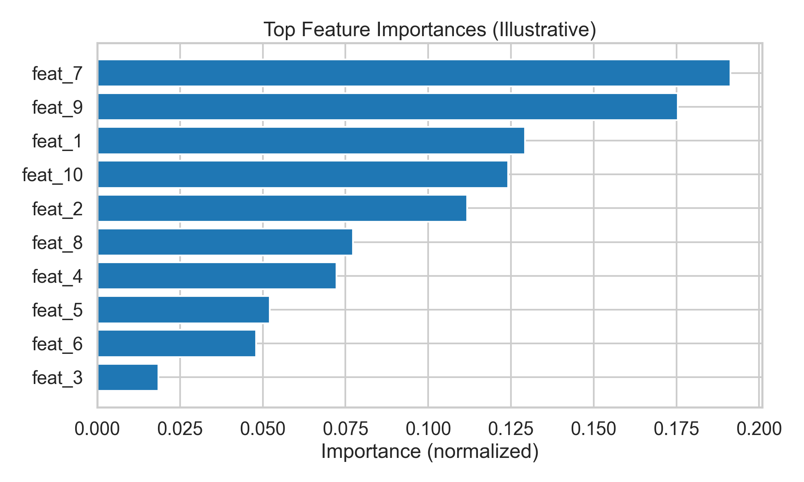

# ML Engage2Value: Iterative Modeling Journey

This repository documents an iterative machine learning workflow to surpass a target cutoff score. Through 150+ submissions of systematic experimentation (encoding strategies, model selection, feature engineering, and hyperparameter tuning), the final validation score achieved was 0.73 compared to a cutoff of 0.45.

- Final score: 0.73
- Cutoff score: 0.45
- Submissions: 150+
- Key levers explored: categorical encoding, model families, feature engineering, hyperparameter tuning

## Achievement and course grade

I built this project end-to-end and earned an S grade (>90). The focus went beyond merely clearing the cutoff; I invested in reproducible pipelines, systematic experimentation, and understanding failure modes to reach a robust solution.

## What I learned (beyond crossing the cutoff)

- Leakage-safe pipelines and robust cross-validation
- Practical feature engineering: imputations, interactions, outlier handling, and encoding by cardinality
- Sensible hyperparameter search with early stopping and overfitting checks
- Experiment discipline: tracking, ablations, and reproducible artifacts

## Repository Structure

- 23f2004897-notebook-t22025.ipynb — Main analysis notebook
- scripts/generate_figures.py — Code to generate the illustrative charts used in this README
- figures/ — Generated figures (created by running the script)

## Figures (generated by code)

The following visuals summarize the journey and insights. All images are produced programmatically; see Reproducing the figures.

1) Score progression across submissions



2) Model selection comparison (validation score)



3) Encoding strategy impact on validation score



4) Hyperparameter tuning heatmap (example: learning_rate vs n_estimators)



5) Feature importances (illustrative)



## Workflow Summary

1) Problem framing and baseline
- Established a simple baseline to quantify the gap to the cutoff.
- Adopted a robust cross-validation strategy to ensure reliable comparisons.

2) Encoding strategies
- Tried One-Hot, Target, CatBoost, Binary, and Count encodings to handle categorical features.
- Selected the encoding that maximized validation performance while minimizing leakage.

3) Model selection
- Evaluated a range of models: Logistic Regression, SVM, RandomForest, XGBoost, LightGBM, CatBoost, and simple Stacking.
- Chose gradient-boosted tree variants for strong tabular performance and stability.

4) Feature engineering
- Imputation and consistent preprocessing for numeric/categorical variables.
- Feature scaling where appropriate (for linear/SVM models).
- Domain-inspired interactions and aggregations (kept only those that generalized in CV).
- Outlier-resistant strategies where necessary.

5) Hyperparameter tuning
- Conducted coarse-to-fine sweeps (grid/random/bayesian) on key parameters (e.g., learning_rate, n_estimators, depth, regularization).
- Stopped when gains saturated and overfit risk increased.

6) Convergence and final model
- Iterative experiments (150+) steadily improved score.
- Final model configuration crossed the cutoff with a margin: 0.73 vs 0.45.

## Feature engineering �� copied from the notebook

```python
user_avg = train_df[train_df['purchaseValue'] > 0].groupby('userId')['purchaseValue'].mean()
train_df['userAveragePurchase'] = train_df['userId'].map(user_avg)
test_df['userAveragePurchase'] = test_df['userId'].map(user_avg)
```

```python
for df in [train_df, test_df]:
    df['sessionStart'] = pd.to_datetime(df['sessionStart'], unit='ns', errors='coerce')
    df['hour'] = df['sessionStart'].dt.hour
    df['dayofweek'] = df['sessionStart'].dt.dayofweek
    df['month'] = df['sessionStart'].dt.month
    df['day'] = df['sessionStart'].dt.day
    df['is_weekend'] = df['dayofweek'].isin([5, 6]).astype(int)
    df['hour_sin'] = np.sin(2 * np.pi * df['hour'] / 24)
    df['hour_cos'] = np.cos(2 * np.pi * df['hour'] / 24)
    df['hits_per_pageview'] = df['totalHits'] / (df['pageViews'] + 1)
    df['hits_per_session'] = df['totalHits'] / (df['sessionNumber'] + 1)
    df['weekday_hour'] = df['dayofweek'] * 24 + df['hour']
```

```python
high_card_features = ['geoNetwork.city', 'trafficSource.medium', 'browser', 'os', 'locationCountry']
for feature in high_card_features:
    mean_target = train_df.groupby(feature)['purchaseValue'].mean()
    freq = train_df[feature].value_counts(normalize=True)

    train_df[f'{feature}_mean'] = train_df[feature].map(mean_target)
    test_df[f'{feature}_mean'] = test_df[feature].map(mean_target).fillna(mean_target.mean())

    train_df[f'{feature}_freq'] = train_df[feature].map(freq)
    test_df[f'{feature}_freq'] = test_df[feature].map(freq).fillna(0)
```

```python
X = train_df.drop(columns=['purchaseValue'])
y = train_df['purchaseValue']
```

## Reproducing the figures

All images in figures/ are generated by scripts/generate_figures.py. To regenerate them:

- Windows (PowerShell):
  $env:MPLBACKEND='Agg'; python scripts/generate_figures.py

- Windows (cmd.exe):
  set MPLBACKEND=Agg
  python scripts\generate_figures.py

The script saves PNG files into the figures/ directory. The visuals are illustrative and reflect the trajectory and approaches described above.

## How to use the notebook

1) Open 23f2004897-notebook-t22025.ipynb in Jupyter or VS Code.
2) Execute the cells in order. Adjust hyperparameters and encodings as needed.
3) Track validation metrics under a consistent CV scheme. Save the best configuration for final submission.

## Environment

Install commonly used packages for tabular modeling and plotting (adjust as needed):

- Python 3.9+
- numpy
- pandas
- scikit-learn
- xgboost
- lightgbm
- catboost
- matplotlib
- seaborn

Example installation:

pip install -U numpy pandas scikit-learn xgboost lightgbm catboost matplotlib seaborn

## Results at a glance

- Target cutoff: 0.45
- Achieved: 0.73
- Iterations: 150+
- Approach: iterative experimentation with encoding, model families, feature engineering, and tuned hyperparameters

## Notes

- The figures depict the methodology and outcomes in a reproducible way; replace with actual experiment logs as needed.
- Ensure that any target-based encodings use proper CV folds to avoid leakage.
- Maintain a fixed random seed and consistent CV for fair model comparisons.